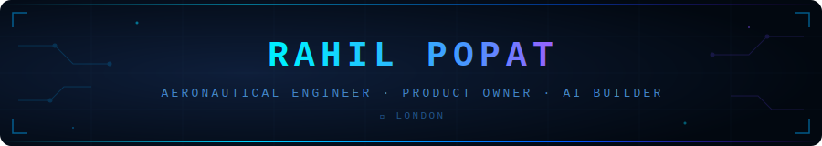

<div align="center">
 

 
</div>
 
<div align="center">
 
[](https://linkedin.com/in/rahilpopat)
[](#)
[](#)
 
</div>
 
<br>
 

 
<br>
 
## `> about.me`
 
> My foundation is **aeronautical engineering** — which taught me to treat complex systems with rigour: mapping failure modes, thinking in feedback loops, and defaulting to pragmatic over perfect.
>
> That lens carried into a decade in **financial services as a Product Owner**, working at the intersection of emerging technology and strategy — across digital assets, tokenisation, and innovation programmes where the constraints were just as tight and the stakes just as real.
>
> Now I apply all of it to **building AI agents**. The tools changed. The discipline didn't.
 
<br>
 

 
<br>
 
## `> background`
 
<div align="center">
 
| 🛩️ | **Foundation** | Aeronautical Engineering |
|:---:|:---|:---|
| 🏦 | **Currently** | Product Owner · Financial Services |
| 🤖 | **Building** | AI Agents |
| 📍 | **Location** | London |
 
</div>
 
<br>
 

 
<br>
 
## `> learning_in_public`
 
```
AI is moving fast — and I'm learning in public.
 
Every project, decision, and dead end gets documented here.
The best way to help other PMs and engineers navigate this space
is to show the journey, not just the destination.
```
 
<br>
 

 
<br>
 
## `> what_you_find_here`
 
🤖 &nbsp;**AI agent projects** — built from scratch, documented as I go
 
🧪 &nbsp;**PM × AI experiments** — applying product thinking to AI workflows
 
💥 &nbsp;**Dead ends included** — because those are often more useful than the wins
 
<br>
 

 
<br>
 
## `> tech_stack`
 
<div align="center">
 


 
</div>
 
<br>
 

 
<div align="center">
<sub><sup>Product Owner · Aeronautical Engineer · AI Geek · London</sup></sub>
</div>
 
